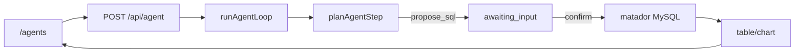

# Home Agent · 大风车数据分析助手

[](https://github.com/jiaxiantao/home-agent/actions/workflows/ci.yml)
[](./LICENSE)

垂直领域 Agent：自然语言问数 → 生成只读 MySQL → 人在回路确认 → 查询大风车 matador 库 → A2UI 表格/图表。

底层仍保留 Plan → Tool → SSE 编排骨架，便于观察与扩展。

演进方向见 [docs/roadmap.md](./docs/roadmap.md)，变更记录见 [CHANGELOG.md](./CHANGELOG.md)。

## 能力

| 工具 | 说明 |
|------|------|
| `list_schema` | 分析库表目录（车源/订单/求购/运营） |
| `propose_sql` | 提出待确认的只读 SQL |
| `execute_sql` | 用户确认后执行（不可由规划器直接触发） |
| `build_chart` | 根据结果生成 bar/line/pie |
| `search_notes` / `calculate` / `current_time` | 原学习型工具，仍可用 |

- 页面：`/agents`（`/` 自动跳转）
- API：`POST /api/agent`（SSE + resume 确认）
- 协议：SSE 向 AG-UI 对齐；结果 UI 用 A2UI

## 架构一览



详细说明见 [docs/architecture.md](./docs/architecture.md) · SSE 协议见 [docs/sse-protocol.md](./docs/sse-protocol.md)

## 协议约定

- `AG-UI`：事件流、会话状态、用户动作回传（`resume.confirm_sql` / `cancel_sql`）
- `A2UI`：声明式 surface（Text / Code / Table / Chart / ButtonGroup）

## 技术栈

- Next.js 16 · React 19 · TypeScript · Tailwind CSS 4 · Recharts
- Prisma · PostgreSQL（应用元数据 / 笔记）
- mysql2（大风车分析库）
- OpenAI SDK（兼容 Ollama）
- Vitest · Playwright

## 本地开发

要求：Node.js 22（见 `.nvmrc`）、pnpm 9、Docker；分析库需 **内网/VPN** 访问 `*.scsite.net`。

```bash
pnpm install
cp .env.example .env
# 在 .env 填写 ANALYTICS_MYSQL_PASSWORD（参照 matador test 配置，勿提交）
docker compose up -d db
pnpm db:setup
pnpm dev
```

打开 [http://localhost:3000/agents](http://localhost:3000/agents)。

### 分析库（MySQL）

默认对接 matador **test**：

- Host: `test.database3500.scsite.net:3500`
- Database: `matador`
- User: `souche_rw`

应用层强制只读 SQL（SELECT/SHOW/DESCRIBE/EXPLAIN）并要求确认后执行。预发/生产 RDS 本期不默认接入。

`GET /api/health` 的 `analyticsMysql` 字段可查看连通性。

### 应用 Postgres 连不上？

`search_notes` 依赖 PostgreSQL。请检查 `DATABASE_URL`、`docker compose up -d db`、`pnpm db:setup`。

### Ollama（可选）

```bash
ollama pull qwen3
ollama serve
```

未配置 LLM 或设置 `LLM_DISABLED=1` 时使用规则规划器（适合 CI）。

### 常用命令

```bash
pnpm typecheck
pnpm lint
pnpm test
pnpm format
pnpm db:setup
pnpm smoke
pnpm test:e2e
```

## API

| 端点 | 说明 |
|------|------|
| `GET /api/health` | Postgres / 分析 MySQL / LLM / Agent 配置 |
| `POST /api/agent` | Agent 循环（SSE；支持 resume 确认 SQL） |
| `GET /api/notes/search?q=&limit=` | 笔记检索 |

## 环境变量

见 [.env.example](./.env.example)。关键项：

- `ANALYTICS_MYSQL_*` — 大风车分析库
- `LLM_DISABLED=1` — 规则规划器
- `AGENT_MAX_STEPS` — 循环最大步数

## Docker

```bash
docker compose up --build
```

Web 默认通过 `host.docker.internal` 连接本机 Ollama。分析库仍需能访问公司内网。

## 贡献

欢迎 Issue 与 PR，见 [CONTRIBUTING.md](./CONTRIBUTING.md)。

## 许可

[MIT](./LICENSE)

## 仓库

https://github.com/jiaxiantao/home-agent
