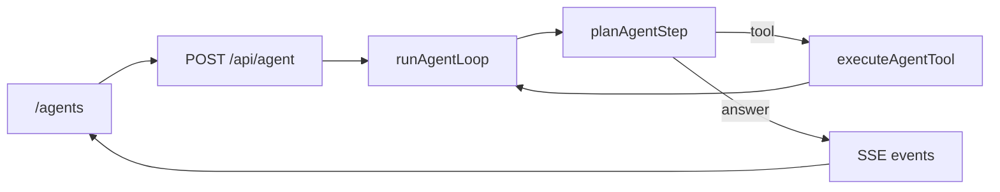

# Home Agent

[](https://github.com/jiaxiantao/home-agent/actions/workflows/ci.yml)
[](./LICENSE)

专注于 **AI Agent 前端编排** 的 Next.js 学习项目：规划器 → 工具调用 → SSE trace 流式输出。

适合用来理解：Agent 循环如何设计、如何用 SSE 驱动编排 UI、如何在无 API Key 时用规则回退跑通 CI。

## 能力

| 工具 | 说明 |
|------|------|
| `search_notes` | 检索知识库笔记（pg_trgm / 内存回退） |
| `calculate` | 安全数学表达式求值 |
| `current_time` | 返回服务器本地时间 |

- 页面：`/agents`（`/` 自动跳转）
- API：`POST /api/agent`（SSE trace）
- 编排偏好（进阶）：浏览器 localStorage，默认折叠

## 架构一览



详细说明见 [docs/architecture.md](./docs/architecture.md) · SSE 协议见 [docs/sse-protocol.md](./docs/sse-protocol.md)

## 协议约定

项目后续演进默认采用两层协议分工：

- `AG-UI` 负责 Agent 与前端之间的双向事件通信与状态同步。
- `A2UI` 负责声明式生成 UI，避免把界面结构混入自由文本或不可校验的 HTML 字符串。

当前仓库中的 SSE trace 可以视为过渡实现。新增交互能力时，优先按 `AG-UI` 事件模型设计；需要表单、列表、按钮、卡片等交互式界面时，优先按 `A2UI` 的结构化消息建模。

## 推荐阅读顺序

1. `src/lib/agent/types.ts` — 事件与规划类型
2. `src/lib/agent/run-loop.ts` — Agent 主循环
3. `src/lib/agent/planner.ts` + `planner-mock.ts` — LLM / 规则规划
4. `src/app/api/agent/route.ts` — SSE 出口
5. `src/hooks/use-agent-sse.ts` — 前端消费 Hook

扩展工具：[docs/add-a-tool.md](./docs/add-a-tool.md)

## 技术栈

- Next.js 16 · React 19 · TypeScript · Tailwind CSS 4
- Prisma · PostgreSQL（`pg_trgm` 可选）
- OpenAI SDK（兼容 Ollama）
- Vitest · Playwright

## 本地开发

要求：Node.js 22（见 `.nvmrc`）、pnpm 9、Docker

```bash
pnpm install
cp .env.example .env
docker compose up -d db
pnpm db:setup
pnpm dev
```

打开 [http://localhost:3000/agents](http://localhost:3000/agents)。

### 数据库连不上？

`search_notes` 依赖 PostgreSQL。若 trace 出现 Prisma / `findMany` 错误，请检查：

1. `.env` 中 `DATABASE_URL` 与 [docker-compose.yml](./docker-compose.yml) 一致（默认 `home_agent` / `postgres`）
2. 已启动数据库：`docker compose up -d db`
3. 已初始化表与种子数据：`pnpm db:setup`

### Ollama（可选）

```bash
ollama pull llama3.2
ollama serve
```

未配置 LLM 或设置 `LLM_DISABLED=1` 时使用规则规划器（适合 CI 与离线学习）。

### 常用命令

```bash
pnpm typecheck    # TypeScript
pnpm lint         # ESLint
pnpm test         # Vitest 单元测试
pnpm format       # Prettier

pnpm db:setup     # 快速本地：db push + seed
pnpm db:migrate   # 正式流程：Prisma migrate

pnpm smoke        # API 冒烟（需先 pnpm dev）
pnpm test:e2e     # E2E（需先 pnpm build && pnpm start:ci）
```

## API

| 端点 | 说明 |
|------|------|
| `GET /api/health` | DB / LLM / pg_trgm 状态 |
| `POST /api/agent` | Agent 工具循环（SSE） |
| `GET /api/notes/search?q=&limit=` | 笔记检索 |

## 环境变量

见 [.env.example](./.env.example)。常用项：

- `LLM_DISABLED=1` — 关闭 LLM，使用规则规划器
- `AGENT_MAX_STEPS` — 循环最大步数（默认 4，上限 12）

## Docker

```bash
docker compose up --build
```

Web 默认通过 `host.docker.internal` 连接本机 Ollama。

## 贡献

欢迎 Issue 与 PR，见 [CONTRIBUTING.md](./CONTRIBUTING.md)。

## 许可

[MIT](./LICENSE)

## 仓库

https://github.com/jiaxiantao/home-agent
