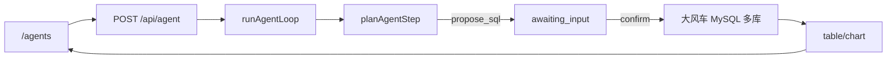

# DFC Data Agent · 大风车数据智能体

[](https://git.souche-inc.com/dfc-ai/dfc-data-agent/-/pipelines)
[](./LICENSE)

**大风车（DFC）数据智能体**：用户用自然语言描述要查的数据，Agent **自动规划**数据库、表与查询条件，生成只读 SQL，用户确认后出数（表格/图表）。无需手动选库选表。

示例：「我想知道客户手机号为 13166990795 的客户信息」→ Agent 路由 CRM 接口 `queryCustomerDetailsByContact`（或 SQL 回退 `super_mario.customer`）→ 返回客户信息。也可按微信号查询。

## 能力

| 工具 | 说明 |
|------|------|
| `route_question` | 按问题语义自动规划候选库/表（可跨库搜元数据） |
| `list_schema` | matador 手写业务口径目录 |
| `search_schema` | 按关键词搜表/字段（支持跨业务库） |
| `propose_sql` | 提出待确认的只读 SQL（建议 \`db\`.\`table\`） |
| `execute_sql` | 用户确认后执行（不可由规划器直接触发） |
| `build_chart` | 根据结果生成 bar/line/pie |

- 页面：`/agents`（`/` 自动跳转）
- API：`POST /api/agent`（SSE + resume 确认）
- 协议：SSE 向 AG-UI 对齐；结果 UI 用 A2UI

## 架构



详见 [docs/architecture.md](./docs/architecture.md) · [docs/sse-protocol.md](./docs/sse-protocol.md)

## 技术栈

- Next.js 16 · React 19 · TypeScript · Tailwind CSS 4 · Recharts
- mysql2（大风车分析库）
- OpenAI SDK（兼容 Ollama / qwen3）
- Vitest · Playwright

## 本地开发

要求：Node.js 22、pnpm 9；分析库需 **内网/VPN** 访问 `*.scsite.net`。

```bash
pnpm install
cp .env.example .env
# 在 .env 填写 ANALYTICS_MYSQL_PASSWORD（参照 matador test，勿提交）
pnpm dev
```

打开 [http://localhost:3000/agents](http://localhost:3000/agents)。

`GET /api/health` 的 `analyticsMysql` 字段可查看分析库连通性。

### 开发异常排查

若点击「确认执行」出现 `HTTP 500` / `TurbopackInternalError` / `ENOENT .next/...`：

1. 停止当前 `pnpm dev`（Ctrl+C）
2. 执行 `pnpm dev:clean`（或 `rm -rf .next && pnpm dev`）
3. 重新提问并确认 SQL

不要在 dev 进程运行时手动删除 `.next` 目录。

### Ollama（qwen3）

```bash
ollama pull qwen3
ollama serve
```

未配置 LLM 或设置 `LLM_DISABLED=1` 时提问会直接报错，不再回退规则规划器。

### 常用命令

```bash
pnpm typecheck
pnpm lint
pnpm test
pnpm smoke      # 需先 pnpm dev
pnpm test:e2e
```

## API

| 端点 | 说明 |
|------|------|
| `GET /api/health` | 分析 MySQL / LLM / Redis / 安全配置 |
| `POST /api/agent` | Agent 循环（SSE；支持 resume 确认 SQL） |
| `GET /api/history` | 当前用户查询历史 |
| `GET /api/favorites` | 收藏问法 |
| `GET /api/templates` | 团队问法模板（管理员可 POST/DELETE） |
| `GET /api/envs` | 可用分析环境列表 |
| `GET /api/databases` | 大风车业务库登记与可见性 |
| `GET /api/audit` | 管理员审计记录查询 |

## 环境变量

见 [.env.example](./.env.example)。关键项：

- `ANALYTICS_MYSQL_*` — 大风车分析库（生产请用只读账号 + `TABLE_ALLOWLIST`）
- `AUTH_MODE` / `AUTH_TOKEN` — 企业内网鉴权（见 [docs/security.md](./docs/security.md)）
- `REDIS_URL` — 多实例待确认 SQL 持久化
- `OLLAMA_MODEL=qwen3` — 默认模型
- `LLM_DISABLED=1` — 关闭 LLM，提问直接报错
- `AGENT_MAX_STEPS` — 循环最大步数

## 企业内网部署

上线前请阅读：

- [docs/security.md](./docs/security.md) — 鉴权、白名单、审计
- [docs/deployment.md](./docs/deployment.md) — Docker/K8s 部署
- [docs/analyst-guide.md](./docs/analyst-guide.md) — 分析师手册

**上线检查**：`GET /api/health` 返回 `ready: true`（MySQL + LLM + Redis + 安全配置均就绪）。

## Docker

```bash
docker compose up --build
```

需在 `.env` 配置分析库与 LLM；分析库仍需公司内网。

## 许可

[MIT](./LICENSE)

## 仓库

https://git.souche-inc.com/dfc-ai/dfc-data-agent
