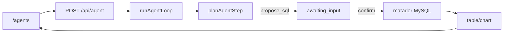

# Home Agent · 大风车数据分析助手

[](https://github.com/jiaxiantao/home-agent/actions/workflows/ci.yml)
[](./LICENSE)

垂直领域 Agent：**自然语言问数 → 只读 MySQL → 人在回路确认 → A2UI 表格/图表**。

对接大风车 matador 测试库，保留 Plan → Tool → SSE 编排骨架，便于观察与扩展。

## 能力

| 工具 | 说明 |
|------|------|
| `list_schema` | 分析库表目录（车源/订单/求购/运营） |
| `propose_sql` | 提出待确认的只读 SQL |
| `execute_sql` | 用户确认后执行（不可由规划器直接触发） |
| `build_chart` | 根据结果生成 bar/line/pie |

- 页面：`/agents`（`/` 自动跳转）
- API：`POST /api/agent`（SSE + resume 确认）
- 协议：SSE 向 AG-UI 对齐；结果 UI 用 A2UI

## 架构



详见 [docs/architecture.md](./docs/architecture.md) · [docs/sse-protocol.md](./docs/sse-protocol.md)

## 技术栈

- Next.js 16 · React 19 · TypeScript · Tailwind CSS 4 · Recharts
- mysql2（大风车分析库）
- OpenAI SDK（兼容 Ollama / qwen3）
- Vitest · Playwright

## 本地开发

要求：Node.js 22、pnpm 9；分析库需 **内网/VPN** 访问 `*.scsite.net`。

```bash
pnpm install
cp .env.example .env
# 在 .env 填写 ANALYTICS_MYSQL_PASSWORD（参照 matador test，勿提交）
pnpm dev
```

打开 [http://localhost:3000/agents](http://localhost:3000/agents)。

`GET /api/health` 的 `analyticsMysql` 字段可查看分析库连通性。

### 开发异常排查

若点击「确认执行」出现 `HTTP 500` / `TurbopackInternalError` / `ENOENT .next/...`：

1. 停止当前 `pnpm dev`（Ctrl+C）
2. 执行 `pnpm dev:clean`（或 `rm -rf .next && pnpm dev`）
3. 重新提问并确认 SQL

不要在 dev 进程运行时手动删除 `.next` 目录。

### Ollama（qwen3）

```bash
ollama pull qwen3
ollama serve
```

未配置 LLM 或设置 `LLM_DISABLED=1` 时使用规则规划器（适合 CI）。

### 常用命令

```bash
pnpm typecheck
pnpm lint
pnpm test
pnpm smoke      # 需先 pnpm dev
pnpm test:e2e
```

## API

| 端点 | 说明 |
|------|------|
| `GET /api/health` | 分析 MySQL / LLM / Agent 配置 |
| `POST /api/agent` | Agent 循环（SSE；支持 resume 确认 SQL） |

## 环境变量

见 [.env.example](./.env.example)。关键项：

- `ANALYTICS_MYSQL_*` — 大风车分析库
- `OLLAMA_MODEL=qwen3` — 默认模型
- `LLM_DISABLED=1` — 规则规划器
- `AGENT_MAX_STEPS` — 循环最大步数

## Docker

```bash
docker compose up --build
```

需在 `.env` 配置分析库与 LLM；分析库仍需公司内网。

## 许可

[MIT](./LICENSE)

## 仓库

https://github.com/jiaxiantao/home-agent
